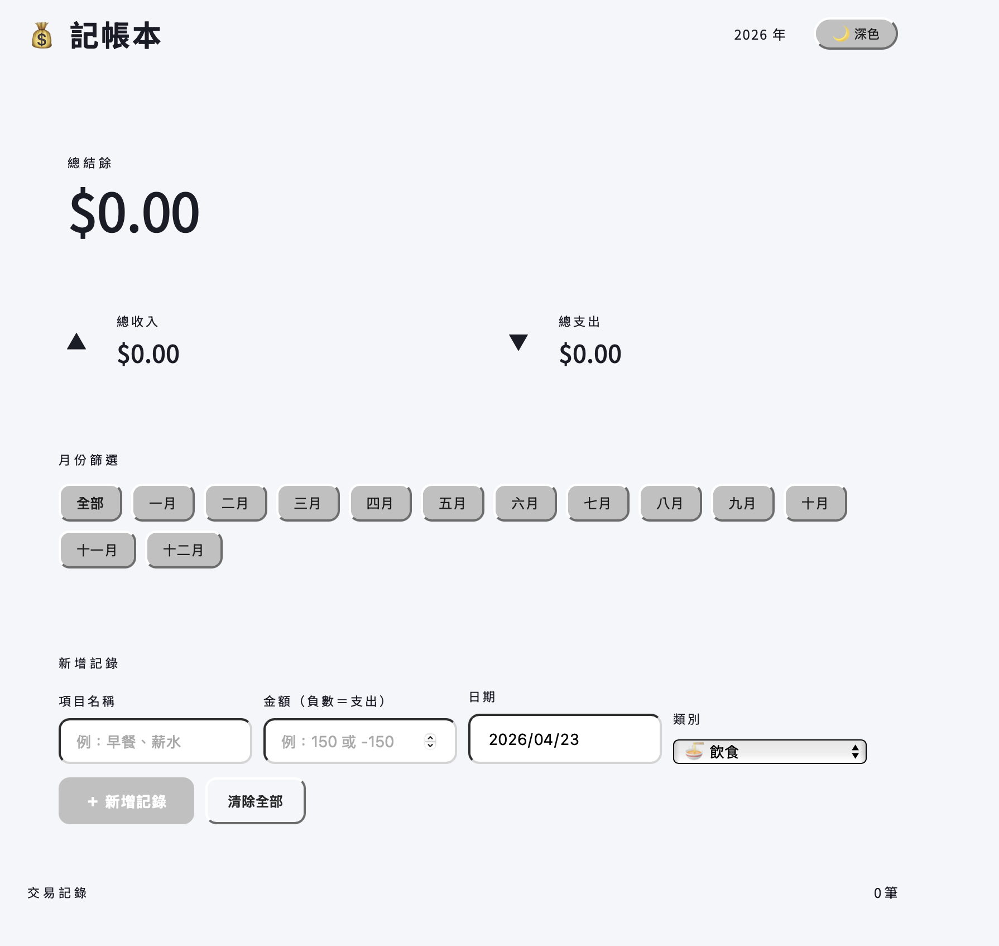

# 記帳本 💰

以HTML、CSS、JavaScript打造的個人記帳 Web App，無需後端、無需安裝，資料儲存於瀏覽器本地端。

🔗 **[Live Demo](https://youzhen0827.github.io/expense-tracker/)**

-----

## 畫面截圖



-----

## 功能特色

- 新增收入／支出記錄，支援 9 種類別（飲食、交通、購物、娛樂、醫療、住居、薪水、投資、其他）
- 即時顯示總結餘、總收入、總支出
- 點選月份按鈕展開當月明細，含收入、支出、結餘摘要
- 深色／淺色主題切換，設定自動儲存
- 刪除單筆記錄或清除全部
- 資料透過 `localStorage` 持久化，重新整理後不遺失
- 支援 Enter 快速新增記錄
- 響應式設計，支援手機瀏覽

-----

## 技術實作

|項目  |說明                                |
|----|----------------------------------|
|語言  |HTML / CSS / JavaScript（無任何框架）    |
|資料儲存|`localStorage`（瀏覽器本地端）            |
|樣式管理|CSS Variables 統一管理深色／淺色主題         |
|字型  |Google Fonts（DM Mono、Noto Sans TC）|

-----

## 如何使用

### 方法一：直接開啟 Live Demo

點上方連結，即可在瀏覽器直接使用，無需安裝。

### 方法二：本地執行

```bash
git clone https://github.com/youzhen0827/expense-tracker.git
cd expense-tracker
```

用瀏覽器開啟 `index.html` 即可，不需要任何伺服器。

-----

## 檔案結構

```
expense-tracker/
├── index.html   # 頁面結構
├── style.css    # 樣式與主題
├── index.js     # 互動邏輯
└── README.md
```

-----

## 學習成果

- 實作 CRUD 操作（新增、讀取、刪除）純用 Vanilla JS
- 使用 `localStorage` 實現資料持久化
- 以 CSS Variables 統一管理深色／淺色雙主題
- 設計響應式版面，適配不同螢幕尺寸
